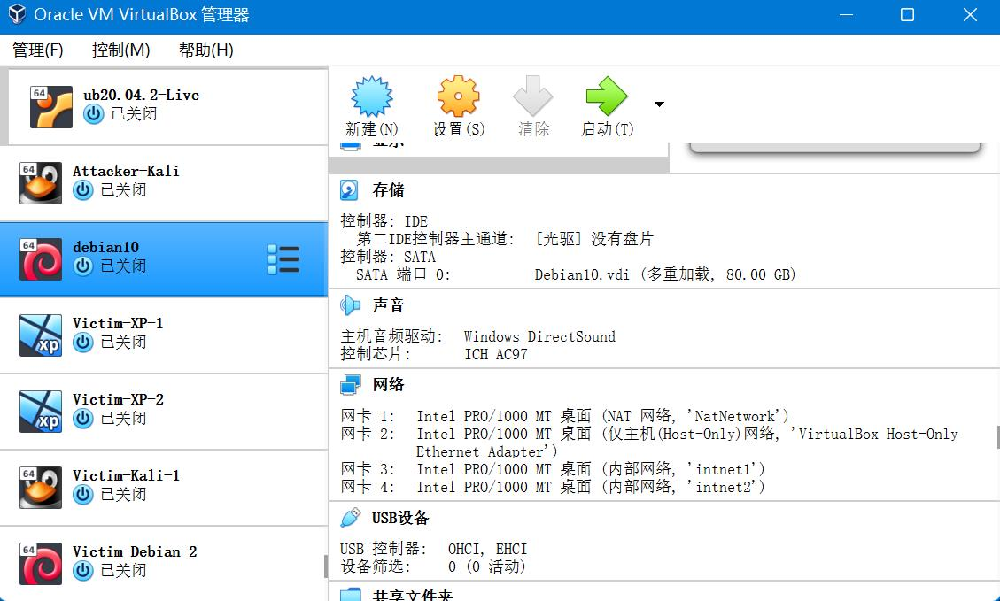
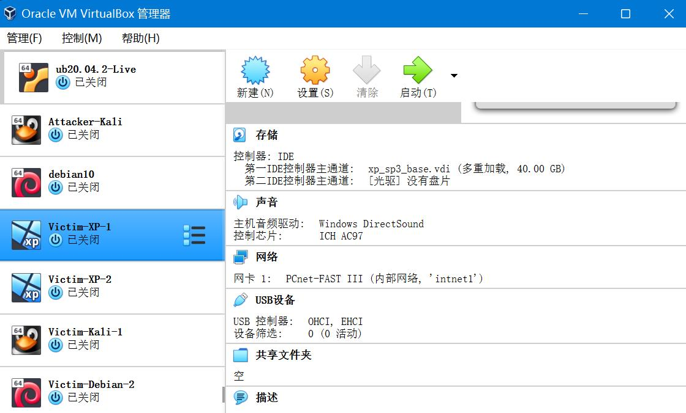

# 基于 VirtualBox 的网络攻防基础环境搭建
## 实验目的
- 掌握 VirtualBox 虚拟机的安装与使用；
- 掌握 VirtualBox 的虚拟网络类型和按需配置；
- 掌握 VirtualBox 的虚拟硬盘多重加载；

## 实验环境
- VirtualBox 虚拟机
- 攻击者主机（Attacker）：Kali Rolling 2019.2
- 网关（Gateway, GW）：Debian Buster
- 靶机（Victim）：From Sqli to shell / xp-sp3 / Kali

## 实验要求
- 虚拟硬盘配置成多重加载；
- 搭建满足如下拓扑图所示的虚拟机网络拓扑；

- 完成以下网络连通性测试；
    - 靶机可以直接访问攻击者主机
    - 攻击者主机无法直接访问靶机
    - 网关可以直接访问攻击者主机和靶机
    - 靶机的所有对外上下行流量必须经过网关
    - 所有节点均可以访问互联网

## 实验过程
### 一、配置虚拟硬盘多重加载
- VirtualBox虚拟机管理 -> 虚拟介质管理
- 选中所需的虚拟盘，将属性 -> 类型 修改为多重加载
- 释放盘片后重新加载虚拟硬盘

### 二、配置拓扑所需网络
- **网关**需四块网卡
    - NAT网络，使网关可访问攻击者主机；
    - 仅主机（Host-Only）网络，进行网卡设置；
    - 内部网络intnet1，搭建局域网1；
    - 内部网络intnet2，搭建局域网2；

- **攻击者**需三块网卡
    - NAT网络;
    - 两块不同的Host-Only.

- **靶机**都需一块网卡
    - 内部网络，使不同组的victim在不同局域网内；
    - victim-xp-1 与 victim-kali-1 在同一局域网内（intnet1），victim-xp2 与 victim-debian-2 在同一局域网内（intnet2）；

### 三、连通性测试
| 节点 | ip地址 |
| :----:| :----: |
| Kali-Attacker | 10.0.2.15 | 
| Kali-Victim1 | 172.16.111.128 | 
| Windows XP-Victim1 | 172.16.111.140 | 
| Debian10-Victim2 | 172.16.222.112 | 
| Windows XP-Victim2 | 172.16.222.112 | 

## 遇到的问题及解决方案
## 参考资料