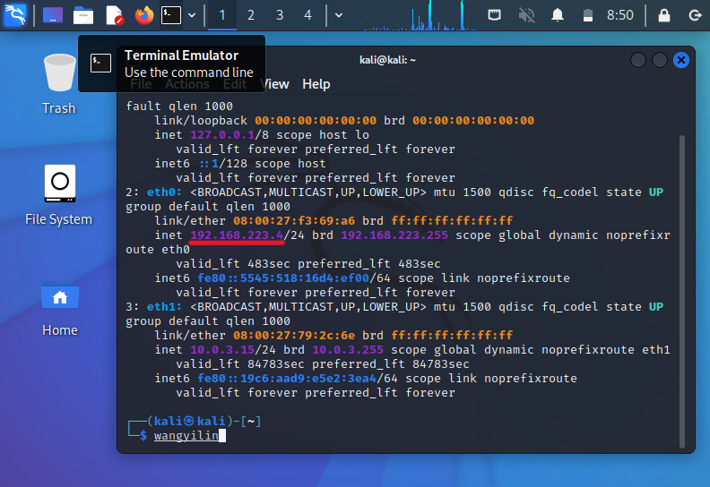
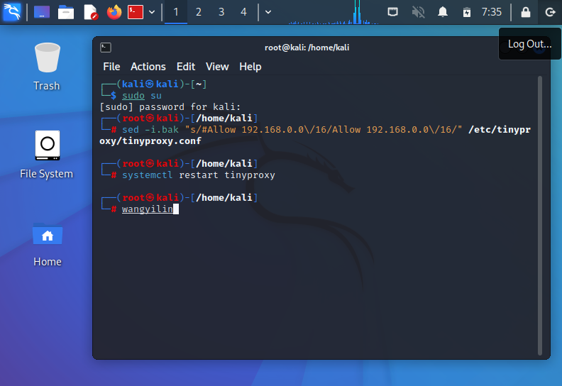
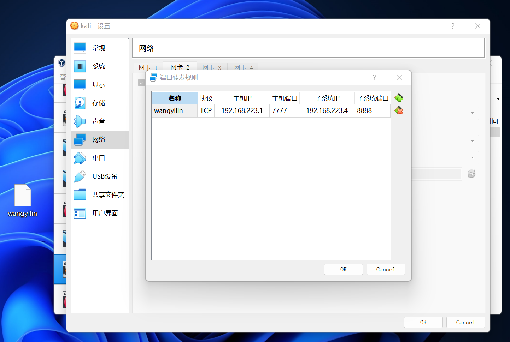
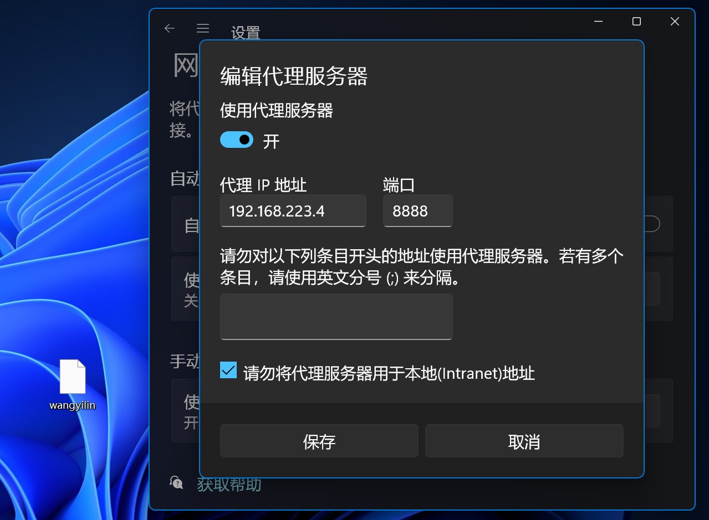
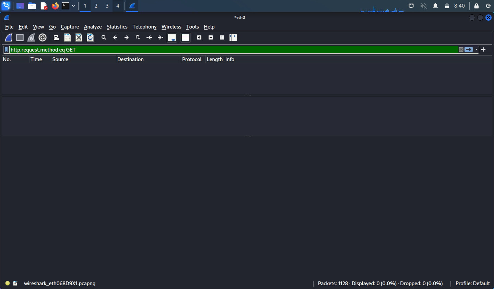
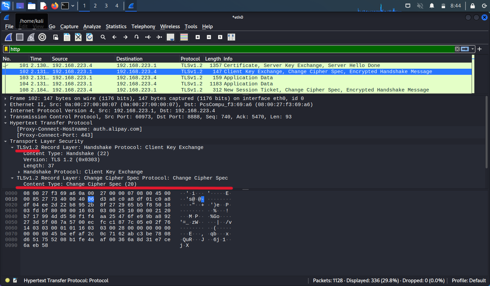
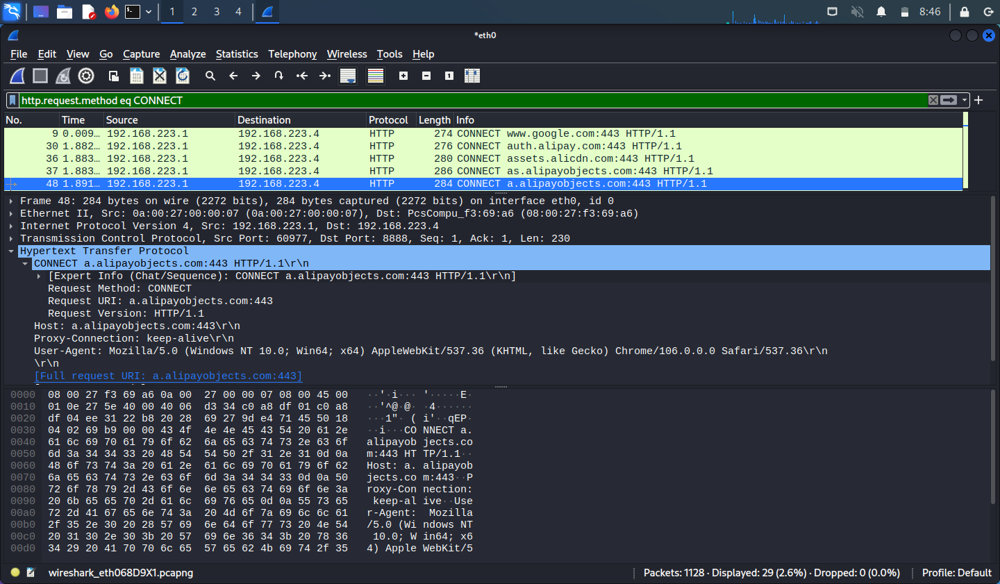

# HTTP代理服务器实验 

## 实验环境

* 虚拟机代理：Kali 192.168.223.4
* 主机：Windows 10 192.168.223.1

## 实验任务
实验验证：
- [x] 在 Kali Linux 中安装 tinyproxy ，然后用主机设置浏览器代理指向 tinyproxy 建立的 HTTP 正向代理
- [x] 在 Kali 中用 wireshark 抓包，分析抓包过程，理解 HTTP 正向代理 HTTPS 流量的特点。

## 实验过程

### 建立 HTTP 正向代理

```shell
# 安装 tinyproxy
sudo apt update 
sudo apt install tinyproxy

# 启动 tinyproxy
sudo systemctl start tinyproxy

# 编辑tinyproxy，取消Allow 192.168.0.0/16行首注释，使其不生效，意思是所有的ip都可访问
sed -i.bak "s/#Allow 192.168.0.0\/16/Allow 192.168.0.0\/16/" /etc/tinyproxy/tinyproxy.conf

# 重启 tinyproxy 服务
systemctl restart tinyproxy

# 设置虚拟机联网方式为Host-Only NAT和端口转发，默认tinyproxy监听8888端口

# 虚拟机里开启wireshark抓包


```




### 主机设置

* 主机浏览器设置代理指向 tinyproxy 的服务地址 192.168.223.4:8888
  
* 主机访问 https 站点 `https://auth.alipay.com/login/index.htm`，虚拟机抓包 eth0 网卡流量

### 结束抓包，分析结果

* 代理服务器不知道客户端和服务器的 HTTPS 通信内容
    * `http.request.method eq GET` 查看所有 HTTP GET 代理请求,发现没有 GET 的数据包
        
    * http 过滤后，通信内容被加密，无法查看
        
* 代理服务器知道客户端访问了哪个 HTTPS 站点，这是由 http 代理的协议机制决定的：代理客户端会发送 Connect 请求到 http 代理服务器。
    * `http.request.method eq CONNECT` 查看所有 HTTPS 代理请求
    * 可以看到代理客户端向代理服务器发送 CONNECT 请求，请求包含了所访问的所有站点。
        

## 遇到的问题及解决方案
1. 无法设置端口转发<br>
解决方案：安装增强功能，端口转发要基于这个增强功能才能进行。
2. 设置代理后主机始终无法上网<br>
解决方案：开启了和Kali使用同一个Host-Only网络的debian虚拟机，关掉它即可。

## 参考资料

- [tcpdump 抓包命令使用教程](https://zhuanlan.zhihu.com/p/74812069)
- [虚拟机配置端口转发](https://blog.csdn.net/qq_26230421/article/details/79232219)
- [VirtualBox设置端口转发](https://blog.csdn.net/qq_32077121/article/details/125908114)