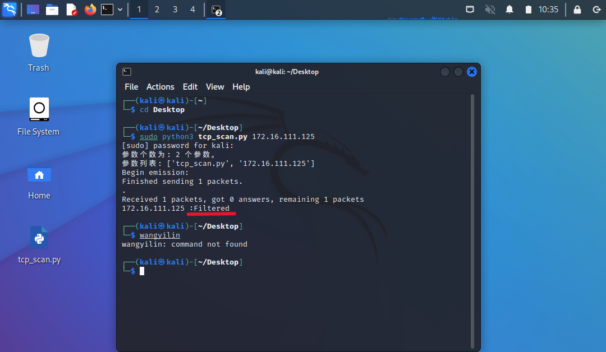
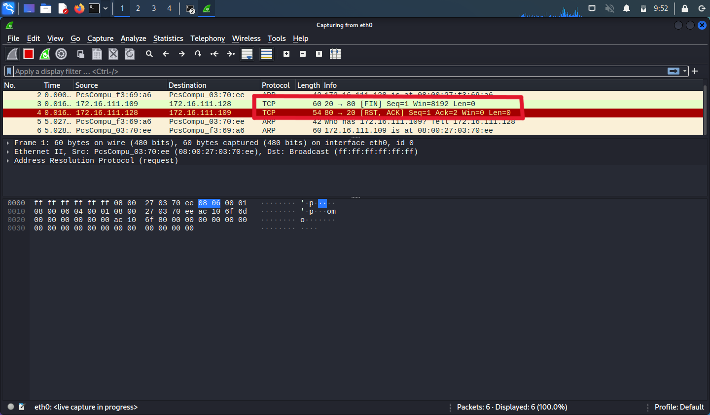
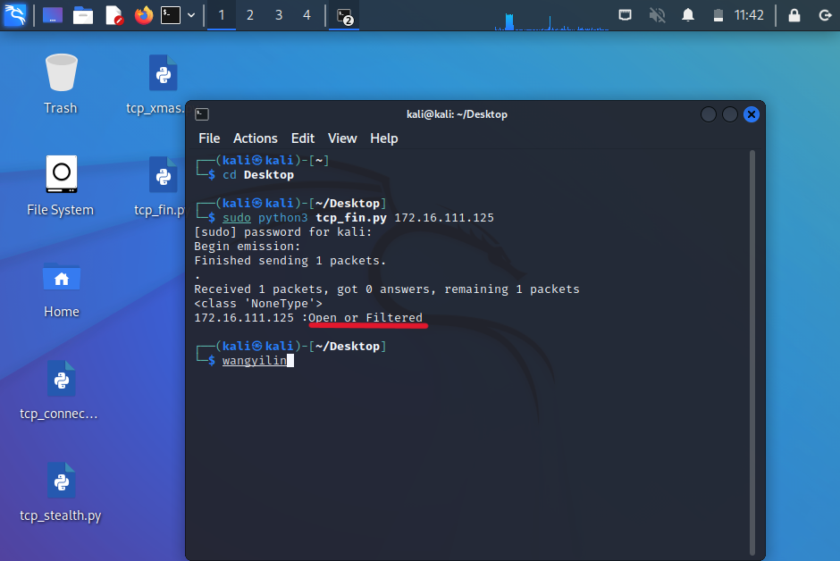
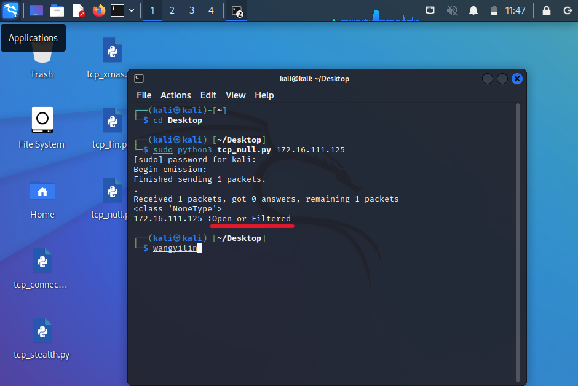
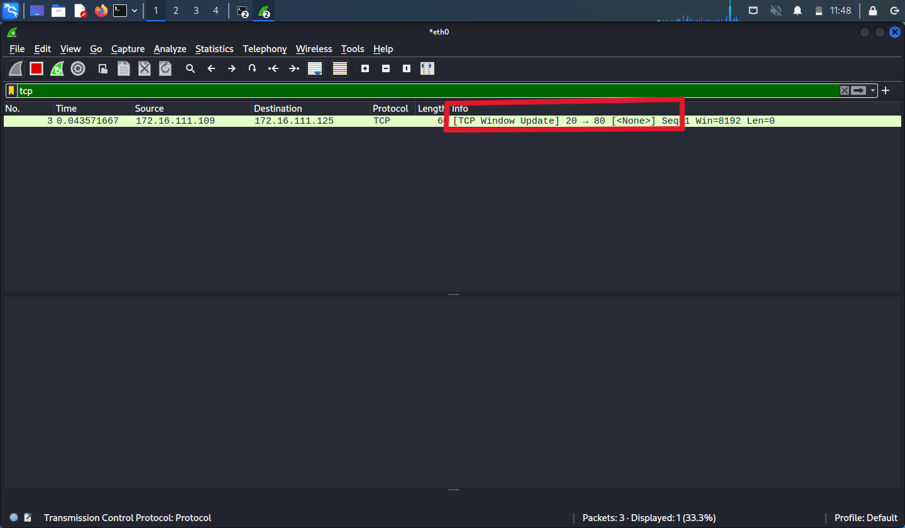

# 基于 Scapy 编写端口扫描器
## 实验目的
- 掌握网络扫描之端口状态探测的基本原理
## 实验环境
- python + scapy
## 实验要求
- 禁止探测互联网上的 IP ，严格遵守网络安全相关法律法规
- 完成以下扫描技术的编程实现
    - TCP connect scan / TCP stealth scan
    - TCP Xmas scan / TCP fin scan / TCP null scan
    - UDP scan
- 上述每种扫描技术的实现测试均需要测试端口状态为：开放、关闭 和 过滤 状态时的程序执行结果
- 提供每一次扫描测试的抓包结果并分析与课本中的扫描方法原理是否相符？如果不同，试分析原因；
- 在实验报告中详细说明实验网络环境拓扑、被测试 IP 的端口状态是如何模拟的

## 实验网络环境拓扑
| GateWay      | Kali-Attacker  | Kali-Victim    |
| ------------ | -------------- | -------------- |
| 172.16.111.1 | 172.16.111.109 | 172.16.111.128 |
## IP 的端口状态模拟
* UDP 端口：
  * ```shell
      # 在 target 主机开启 8080 端口
      nc -l -u -p 8080 
      # 局域网内其他主机可通过该操作向端口发送数据报，但是不会收到回复
      nc 172.16.111.120 -u 8080

      # 在 target 主机开启 8080 端口
      nc -l -u -p 8080 < /etc/passwd
      # 局域网内其他主机可通过该操作向端口发送数据报，会收到一个响应报
      nc 172.16.111.120 -u 8080
    ```
* 开放的端口：Target 开启 apache2 服务，端口号为 80
  * ```shell
      sudo systemctl start apache2
      sudo systemctl status apache2
    ```
* 关闭的端口：Target 关闭 apache2 服务，Attacker 扫描 80 端口
* 过滤状态：开启防火墙设置
  * ```shell
      sudo apt install ufw
      sudo ufw enable
      ufw deny 80
      sudo ufw default deny
      ``` 

## 实验过程

### TCP connect scan

* 课本原理如下：
  * Attacker 首先发送一个 SYN 数据包到目标主机端口
  * 如果接收到数据包，对数据包进行分析
    * 接收到 SYN/ACK 数据包：判断端口为开放状态，发送 ACK/RST 数据包
    * 接收到 RST/ACK 数据包：判断端口为关闭状态
  * 如果没有响应：被过滤

* 编写代码
```python
 # -*-coding:utf-8 -*-
    #! /usr/bin/python3

  from scapy.all import *
  import sys
 
  print('参数个数为:', len(sys.argv), '个参数。')
  print('参数列表:', str(sys.argv))

  dst_ip = "172.16.111.125"
  dst_ip=sys.argv[1] # target ip
  src_ip = "172.16.111.109"
  src_port = RandShort() # 随机分配端口号
  dst_port=80

  tcp_connect_scan_pkt = sr1(IP(src=src_ip,dst=dst_ip)/TCP(sport=src_port,dport=dst_port,flags="S"),timeout=10)    #SYN #只接受一个回复的数据包
  if(str(type(tcp_connect_scan_pkt))=="<class 'NoneType'>"): # 无回应
    print(dst_ip,":Filtered")
  elif(tcp_connect_scan_pkt.haslayer(TCP)):
    if(tcp_connect_scan_pkt.getlayer(TCP).flags == 0x12): # 收到 SYN/ACK
        send_rst = sr(IP(dst=dst_ip)/TCP(sport=src_port,dport=dst_port,flags="AR"),timeout=10)   # 发送 RST/ACK 包
        print(dst_ip,":Open")
    elif(tcp_connect_scan_pkt.getlayer(TCP).flags == 0x14): # RST
        print(dst_ip,":Closed")
```

* attacker 运行代码`python3 tcp-scan.py 172.16.111.125`，使用wireshark 抓包，查看结果与抓包结果

  * tcp 端口开放：可以看到 Attacker 发送 SYN 的TCP 数据包后， 80 端口进行握手回复了 SYN/ACK 数据报；Attacker 回复 RST 数据报，80 端口回复 RST/ACK 数据报。
  
  
  
  * tcp 端口关闭：可以看到 Attacker 发送 SYN 的TCP 数据包后， 80 端口关闭回复了 RST/ACK 数据报。
  
  
  
  * 开启防火墙： 可以看到 Attacker 发送 SYN 的TCP 数据包后， 80 端口无回应。
  
  
  


### TCP stealth scan

* 课本原理如下：
  * Attacker 首先发送一个 SYN 数据包到目标主机端口
  * 如果接收到数据包，对数据包进行分析
    * 接收到 SYN/ACK 数据包：判断端口为开放状态，发送 RST 数据包
    * 接收到 RST/ACK 数据包：判断端口为关闭状态
  * 如果没有响应：被过滤
  * TCP stealth scan 与 TCP connect scan 的不同点在于收到 SYN/ACK 数据包后的回复策略，TCP stealth scan 为了躲避防火墙的探测

* 编写代码
```python
    # -*-coding:utf-8 -*-
    #! /usr/bin/python3

  from scapy.all import *
  import sys
 
  print('参数个数为:', len(sys.argv), '个参数。')
  print('参数列表:', str(sys.argv))

  dst_ip = "172.16.111.125"
  dst_ip=sys.argv[1] # target ip
  src_ip = "172.16.111.109"
  src_port = RandShort() # 随机分配端口号
  dst_port=80

  tcp_stealth_scan_pkt = sr1(IP(src=src_ip,dst=dst_ip)/TCP(sport=src_port,dport=dst_port,flags="S"),timeout=10)    #SYN #只接受一个回复的数据包
  if(str(type(tcp_stealth_scan_pkt))=="<class 'NoneType'>"): # 无回应
    print(dst_ip,":Filtered")
  elif(tcp_stealth_scan_pkt.haslayer(TCP)):
    if(tcp_stealth_scan_pkt.getlayer(TCP).flags == 0x12): # 收到 SYN/ACK
        send_rst = sr(IP(dst=dst_ip)/TCP(sport=src_port,dport=dst_port,flags="R"),timeout=10)   # 发送 RST 包
        print(dst_ip,":Open")
    elif(tcp_stealth_scan_pkt.getlayer(TCP).flags == 0x14): # RST
        print(dst_ip,":Closed")

```

* attacker 运行代码`python3 tcp-stealth.py 172.16.111.125`，使用wireshark 抓包，查看结果与抓包结果

  * tcp 端口开放：可以看到 Attacker 发送 SYN 的TCP 数据包后， 80 端口进行握手回复了 SYN/ACK 数据报；Attacker 回复 RST 数据报。
  
  
  
  * tcp 端口关闭：可以看到 Attacker 发送 SYN 的TCP 数据包后， 80 端口关闭回复了 RST/ACK 数据报。
  
  
  
  * 开启防火墙：可以看到 Attacker 发送 SYN 的TCP 数据包后， 80 端口无回应。
  
  


### TCP Xmas scan

* 课本原理如下：
  * Attacker 发送一个 TCP 数据包到目标主机端口，并对 TCP 报文头 FIN URG PUSH 标记进行设置
  * 如果接收到数据包，对数据包进行分析
    * 接收到 RST 数据包，则端口状态为关闭
  * 如果没有响应，则端口状态为开放或过滤
* 编写代码
```python
  # -*-coding:utf-8 -*-
    #! /usr/bin/python3

  from scapy.all import *
  import sys
  dst_ip = "172.16.111.125"
  dst_ip=sys.argv[1] # target ip
  src_ip = "172.16.111.109"
  src_port = RandShort() # 随机分配端口号
  dst_port=80

  xmas_scan_pkt = sr1(IP(dst=dst_ip)/TCP(dport=dst_port,flags="FPU"),timeout=10) #发送一个 TCP 数据包到目标主机端口，并对 TCP 报文头 FIN URG PUSH 标记进行设置
  print(str(type(xmas_scan_pkt)))
  if (str(type(xmas_scan_pkt))=="<class 'NoneType'>"): # 没有响应
        print(dst_ip,":Open or Filtered")
  elif(xmas_scan_pkt.haslayer(TCP)):
    if(xmas_scan_pkt.getlayer(TCP).flags == 0x14): # 接收到 RST 数据包
        print(dst_ip,":Closed")
    elif(xmas_scan_pkt.haslayer(ICMP)):# 接收到 ICMP 包
        if(int(xmas_scan_pkt.getlayer(ICMP).type)==3 and int(xmas_scan_resp.getlayer(ICMP).code) in [1,2,3,9,10,13]):
            print(dst_ip,":Filtered")
```
* attacker 运行代码`python3 tcp-xmas.py 172.16.111.125`，使用wireshark 抓包，查看结果与抓包结果
  * tcp 端口开放：可以看到 Attacker 发送一个 TCP 数据包 FIN URG PUSH 标记进行设置，80 端口无回应。
  
  
  * tcp 端口关闭：可以看到 Attacker 发送一个 TCP 数据包 FIN URG PUSH 标记进行设置，80 端口回复 RST/ACK TCP 数据报。
  
  
  * 开启防火墙：可以看到 Attacker 发送一个 TCP 数据包 FIN URG PUSH 标记进行设置，80 端口无回应。
  
  


### TCP fin scan 

* 课本原理如下：
  * Attacker 发送一个 TCP FIN 数据包到目标主机端口
  * 如果接收到数据包，对数据包进行分析
    * 接收到 RST 数据包，则端口状态为关闭
  * 如果没有响应，则端口状态为开放或者被过滤
* 编写代码
```python
  
  # -*-coding:utf-8 -*-
    #! /usr/bin/python3

  from scapy.all import *
  import sys
  dst_ip = "172.16.111.125"
  dst_ip=sys.argv[1] # target ip
  src_ip = "172.16.111.109"
  src_port = RandShort() # 随机分配端口号
  dst_port=80

  fin_scan_pkt = sr1(IP(dst=dst_ip)/TCP(dport=dst_port,flags="F"),timeout=10) #发送一个 TCP 数据包到目标主机端口，并对 TCP 报文头 FIN URG PUSH 标记进行设置
  print(str(type(fin_scan_pkt)))
  if (str(type(fin_scan_pkt))=="<class 'NoneType'>"): # 没有响应
        print(dst_ip,":Open or Filtered")
  elif(fin_scan_pkt.haslayer(TCP)):
    if(fin_scan_pkt.getlayer(TCP).flags == 0x14): # 接收到 RST 数据包
        print(dst_ip,":Closed")
    elif(fin_scan_pkt.haslayer(ICMP)):# 接收到 ICMP 包
        if(int(fin_scan_pkt.getlayer(ICMP).type)==3 and int(fin_scan_resp.getlayer(ICMP).code) in [1,2,3,9,10,13]):
            print(dst_ip,":Filtered")
```
* attacker 运行代码`python3 tcp-fin.py 172.16.111.125`，使用wireshark 抓包，查看结果与抓包结果

  * tcp 端口开放：可以看到 Attacker 发送一个 TCP 数据包 FIN 标记进行设置，80 端口无回应。
  
  
  * tcp 端口关闭：可以看到 Attacker 发送一个 TCP 数据包 FIN 标记进行设置，80 端口回复 RST/ACK TCP 数据报。
  
  
  * 开启防火墙：可以看到 Attacker 发送一个 TCP 数据包 FIN 标记进行设置，80 端口无回应。 
  
  


### TCP null scan

* 课本原理如下：
  * Attacker 发送一个 TCP 数据包到目标主机端口，且 TCP 报文头未进行 Flag 设置
  * 如果接收到数据包，对数据包进行分析
    * 接收到 RST 数据包，则端口状态为关闭
  * 如果没有响应，则端口状态为开放或过滤
* 编写代码
```python
  
  # -*-coding:utf-8 -*-
    #! /usr/bin/python3

  from scapy.all import *
  import sys
  dst_ip = "172.16.111.120"
  dst_ip=sys.argv[1] # target ip
  src_ip = "172.16.111.131"
  src_port = RandShort() # 随机分配端口号
  dst_port=80

  xmas_scan_pkt = sr1(IP(dst=dst_ip)/TCP(dport=dst_port,flags=""),timeout=10) #发送一个 TCP 数据包到目标主机端口，并对 TCP 报文头 FIN URG PUSH 标记进行设置
  print(str(type(xmas_scan_pkt)))
  if (str(type(xmas_scan_pkt))=="<class 'NoneType'>"): # 没有响应
        print(dst_ip,":Open or Filtered")
  elif(xmas_scan_pkt.haslayer(TCP)):
    if(xmas_scan_pkt.getlayer(TCP).flags == 0x14): # 接收到 RST 数据包
        print(dst_ip,":Closed")
    elif(xmas_scan_pkt.haslayer(ICMP)):# 接收到 ICMP 包
        if(int(xmas_scan_pkt.getlayer(ICMP).type)==3 and int(xmas_scan_resp.getlayer(ICMP).code) in [1,2,3,9,10,13]):
            print(dst_ip,":Filtered")

```
* attacker 运行代码`python3 tcp-null.py 172.16.111.120`，使用wireshark 抓包，查看结果与抓包结果

  * tcp 端口开放：可以看到 Attacker 发送一个 TCP 数据包 FLAG 标记为空，80 端口无回应。
  
  
  * tcp 端口关闭：可以看到 Attacker 发送一个 TCP 数据包 FLAG 标记为空，80 端口回应 RST/ACK TCP 数据报。
  
  
  * 开启防火墙：可以看到 Attacker 发送一个 TCP 数据包 FLAG 标记为空，80 端口无回应。 
  
  


## 实验总结

1. 扫描方式与端口状态的对应关系：

| 扫描方式/端口状态             | 开放                            | 关闭            | 过滤            |
| ----------------------------- | ------------------------------- | --------------- | --------------- |
| TCP connect / TCP stealth     | 完整的三次握手，能抓到ACK&RST包 | 只收到一个RST包 | 收不到任何TCP包 |
| TCP Xmas / TCP FIN / TCP NULL | 收不到TCP回复包                 | 收到一个RST包   | 收不到TCP回复包 |
| UDP                           | 收到UDP回复包                   | 收不到UDP回复包 | 收不到UDP回复包 |

2. 提供每一次扫描测试的抓包结果并分析与课本中的扫描方法原理是否相符？如果不同，试分析原因。

> 相符

  ## 遇到的问题及解决方案
  1. 开启防火墙设置出现错误
      ```shell
      # 错误的开启方式
      sudo systemctl start ufw
      sudo status ufw
      # inactive

      # 正确的开启方式
      sudo ufw enable
      ``` 
  
  ## 参考链接

- [Linux kali开启端口、关闭防火墙](https://blog.csdn.net/qq_42103479/article/details/90111365)
- [ c4pr1c3/cuc-ns-ppt ](https://github.com/c4pr1c3/cuc-ns-ppt/blob/master/chap0x05.md)
- [port-scanning-using-scapy](https://resources.infosecinstitute.com/topic/port-scanning-using-scapy/)
